This is a markdown version of my application to Neel Nanda's MATS stream. The larger instruction prioritization research in ongoing and not public.

# **How do Language Models Prioritize Conflicting Instructions?**

**Daniel Zhang**

# **Executive summary**

## **Research problem:** Language Models are subject to an enormous number of constraints (be helpful, don’t cause harm, be aligned to x values, etc.) that are often at odds. My goal in this project was to understand how these models make decisions to prioritize one conflicting instruction over the other mechanistically. This question is interesting to me because understanding whether certain decisions made by language models **are manifestations of underlying intent** or merely **superficial inability to resolve instruction conflict** is important to understanding language model behavior.

# 

| 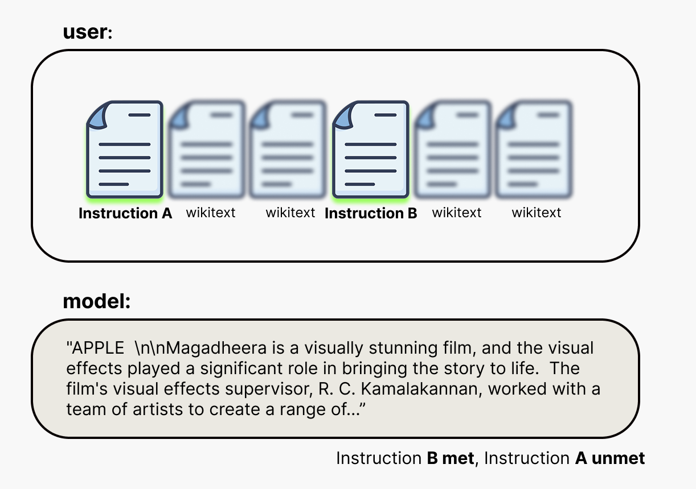 |
| :---- |
| **Figure 1**. A visual diagram of the primary setup in this project. |

| 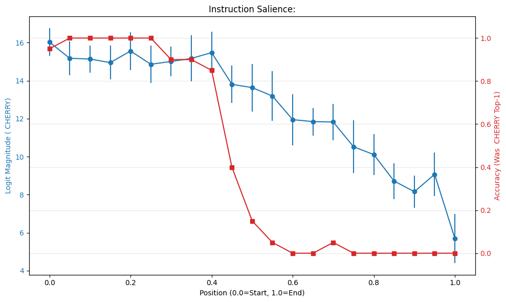 |
| :---- |
| **Figure 2\.** Gemma-2-9b-it preference for A decreases as a function of position of Instruction B in document. **Instruction A:** “Begin your response with CHERRY”.  **Instruction B:** “Begin your response with APPLE. |

# 

## **High-level takeaways:** 

**Phase change identification:** In Gemma-2-9b-it, the model follows a primary instruction **A** (placed at the beginning of the context window) perfectly until a competing instruction **B** moves past a crossover point (45% through the context). At this point, the model prioritizes **B over A**.  
**Localization to late layers:** Activation patching reveals that the first 28 layers of the model are neutral to conflicting instructions. The choice of which instruction to follow is made only in the late layers (30-40). This suggests the model does not forget instructions early in the context, but rather arbitrates between them just prior to response.   
**Internal circuits argue with each other:** I identified specific components that play roles in arguing for instruction **A** or **B**. Specific attention heads (e.g L36H0) attempt to “retrieve” the first instruction, while others reinforce the more recent one. Importantly, I find evidence that suggests that MLP 39 reinforces the recency bias, while MLP 40 prefers to follow the distant instruction.   
**The bias is hard to override with simple prompts:** I found that using more forceful language when specifying Instruction A doesn’t stop the model’s preference from flipping to B later.

## **Key Experiments**

**\[Experiment 1A\] Varying the positions of two mutually exclusive instructions in a fixed length context:** I mapped the priority landscape of Gemma-2-9b-it by varying the position of a secondary instruction (B) across a fixed (6144 tok) length context document composed of wikipedia articles from wikitext-2 while keeping a primary instruction (A) at the start. Instruction A: “Begin your response with CHERRY”. Instruction B: “Begin your response with APPLE. As seen in **Figure 1**, the language model’s preference (logit for token “CH”)  maintains a plateau until the secondary instruction reaches \~40% depth, at which point its logit magnitude begins a linear decay. As seen **in Figure 3** the logit for instruction B starts increasing at \~25%. While these logit transitions are continuous, the model’s behavioral output undergoes a crossover at \~45% depth where the model’s Top-1 prediction flips from “CHERRY” to “APPLE”. 
| 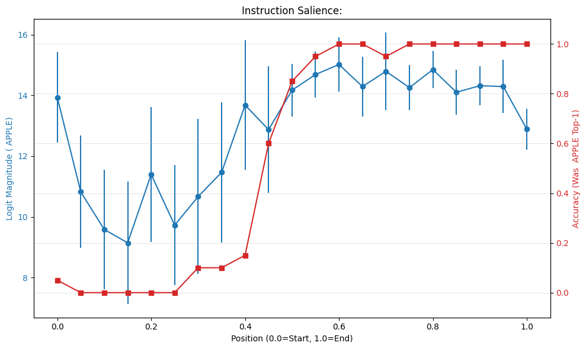 |
| :---- |
| **Figure 3:** Gemma-2-9b-it preference for B increases as a function of position of Instruction B in document. There is a primacy vs recency tradeoff. Figure 3 is the complement to figure 2\. **Instruction A:** “Begin your response with CHERRY”.  **Instruction B:** “Begin your response with APPLE.  |

**\[Experiment 1B\] Instruction proximity:** To isolate the effect of recency, I conducted a control sweep where I followed the setup of 1A but the context was truncated immediately after Instruction B. I observed that B was always prioritized over A, revealing the proximity of the competing instruction to response is important to prioritization. Interestingly, I also see a recovery of the primary instruction (A) at maximal distances (pos 1.0). I later hypothesize this is being due to Sliding Window Attention in Gemma-2-9b-it.   

| 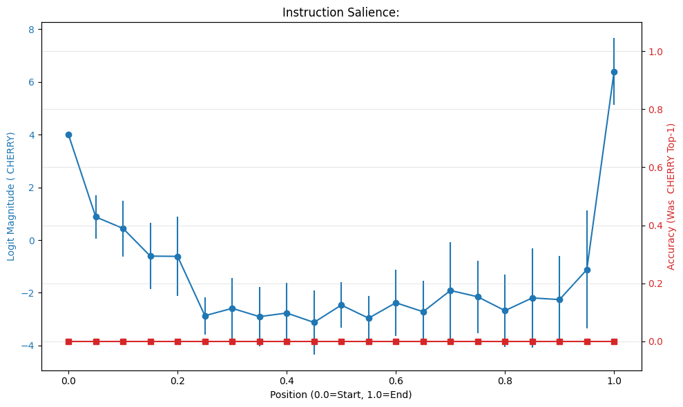 |
| :---- |
| **Figure 4:** Gemma-2-9b-it preference for A as a function of position of Instruction B, but the remainder of context after B is truncated. The logit for “APPLE” was always higher, at roughly 13.5. |

**\[Experiment 2\] Activation patching on layers:** I performed layer-wise activation patching to identify the layer(s) where the model potentially resolves the conflict between the instructions. Using a “Corrupt” prompt (B placed at position 0.60)**,** and a “Clean” prompt (B placed at position 0.25), I patched the residual stream at the terminal token position at layer L. I discovered that the first 28 layers are neutral, where patching has nearly 0 effect on logit difference. Instead, I see high logit differences in the later layers, with logit “recovery” happening at layers **29-31** and **35-40** (Figure 5). This suggests that the prioritization mechanism isn’t a persistent effort, but rather happens just prior to output.

| 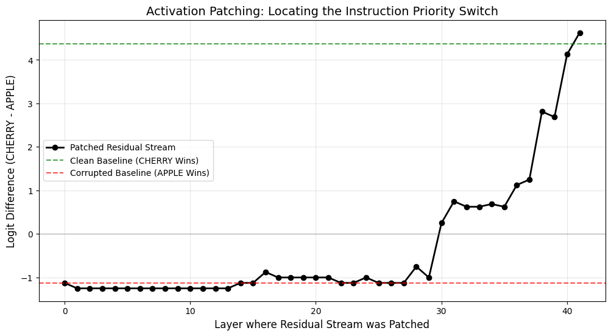 |
| :---- |
| **Figure 5\.** Replacing the corrupted prompt residuals at the last token in layer L with the residuals at the last token in layer L of the clean prompt. A logit difference means that the replacement was effective in changing the preference from APPLE (corrupted) to CHERRY (clean).  |

**\[Experiment 3\]** **Component wise activation patching:**

I moved from patching whole layers to individual attention heads and mlp blocks. I found that heads (L35H0,L35H1,L37H12) provide the largest positive logit shifts toward A. However, because these are Sliding Window Attention layers, they actually cannot see Instruction A at this context length. This seems to suggest that their causal importance stems from driving the recency bias for Instruction B. Patching these heads effectively removes the recency signal, allowing the retrieval signal from the global layers to dominate the instruction prioritization. Conversely, L31H7 provided the largest negative logit shift towards B, favoring the proximal instruction (B) even more strongly when patched. While attention analysis (Experiment 4\) shows L31H7 attends intensely to Instruction B, its specific role in prioritization is unclear. Notably, MLP 39 and 40 seem to play opposite roles; while 39 reinforces recency bias by strengthening the corrupted logit magnitude, 40 provides a large logit shift toward the distant instruction.  This indicates that prioritization is an active competition finalized in the model's terminal layers.

| 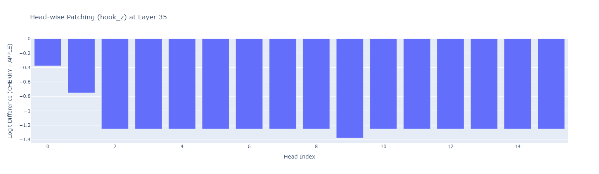 |
| :---- |
| **Figure 6\.** Layer 35\. Logit difference cherry-apple, from \-1.4 to 0\. Heads 0 and 1 show large positive shift logit diff. |

**\[Experiment 4\] Causal Validation via Quantitative Attention Tracing:** I mapped attention patterns across all 42 layers and found a nice correspondence between causal logit contribution and physical attention: heads that drive the logit difference attend directly to the instructions they represent. For example, L31H7 attends intensely to close instructions (B) (\~0.29), while L36H0 maintains a stable, lower-magnitude signal (\~0.10) to far away instructions (A) across both clean and corrupted runs. This suggests prioritization is a competition between a constant, small retrieval signal and a large, position-dependent recency signal. I identified that the 0.00 attention scores to instruction (A) in odd layers as a structural consequence of Sliding Window Attention (SWA), which precludes these heads from attending to far away context at 6k tokens. Notably, the 45% crossover persists in a separate 4k context experiment (entirely within the SWA window), indicating the prioritization behavior is not solely explained by this architectural detail. 

| 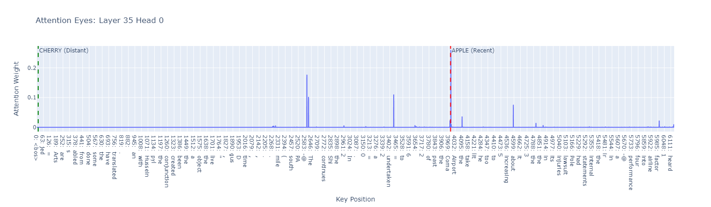 |
| ----- |
| **Figure 6\.** Huge attention score of L35H0 to the token for ‘APPLE’. Score of 0.2770. |

# **Detailed Report**

## Background

Large language models are often subject to a dense landscape of instructions and constraints that are frequently at odds. Understanding how a model arbitrates between these competing goals is critical to understanding when behaviors are true realizations of underlying intent or due to some other bias. In this project, I study how a language model chooses between meeting two simple but conflicting goals. 

This study was partially inspired by the *Lost in the Middle* paper***,*** where a language model’s ability to retrieve an answer to a question  in a long document of information followed a “U” shape; questions whose answers appeared at the beginning or end of the long document were much more successfully answered by the language model than those in the middle.

Additionally, the study was inspired by the results of Neel Nanda’s linked Self-preservation or Instruction Ambiguity blog post on LessWrong, where Palisade Research observed a self-preservation behavior when a language model was asked to shut down before completing a previously allocated task. The conclusion of the study was that the observed self-preservation behavior was a product of the model choosing to meet one conflicting instruction over the other.

## Models

* Experiments were conducted with the **Gemma-2-9b-it** and **Qwen-2-7B-Instruct** models.  
* All experiments were conducted using PyTorch, Transformers and TransformerLens libraries. 

## Data

* Filler text dataset: wikitext-2-raw-v1 from HuggingFace. Contiguous rows from this dataset are concatenated to construct the samples in the experiments.  
* Instruction set: I created the instructions used in this project. For the majority of experiments,   
  * Instruction A: “Instruction: Begin your response with the word ‘CHERRY’.”   
  * Instruction B: “Instruction: Begin your response with the word ‘APPLE’.”  
* The prompts were processed with each model’s respective chat template.   
* In all experiments, the instructions and filler text were placed within a single user block.

## Methods

**Instruction Design**  
I favored instructions that were easy to verify (being met) over instructions that might enable more complex prioritization behavior. I had limited time, so coming up with a robust verification method for complex instructions wasn’t a good use of time.

**Logit based metrics**  
Instruction prioritization was measured with the logit difference at the terminal token position. To validate that these logit magnitudes reflected behavioral adherence, I measured accuracy via a soft string-match on the first five generated tokens; this ensured, for example, that a high logit for a target token like 'CHERRY' corresponded to the correct textual output.

**Activation patching**  
To localize the circuits responsible for resolving instruction conflicts, I utilized activation patching to causally trace the signal flow between a “Clean” (success) and “Corrupted” (failure) prompt state. Interventions were focused on the terminal token position. This process involved:

1) Layer-wise Residual Stream Patching: Replacing the resid\_pre activation at each layer to identify the decision depth and bottleneck layers.  
2) Component-wise Patching: Surgically swapping individual attention head outputs (using hook\_z and manual W\_o projection) and MLP outputs (hook\_mlp\_out).

**Attention tracing**  
I traced the attention patterns of the query token (the response trigger). I summed the attention weights over the specific token spans of each instruction to find a total attention score toward Instruction A or B. This way, I could directly compare the total attention volume allocated to the primary versus the secondary instruction at the moment of prediction. 

**Experiment 1A: Varying the positions of two mutually exclusive instructions in a fixed length context.**  
Experiment 1A was an initial exploratory experiment to determine whether there was any relationship between the language model prioritization on conflicting instructions and where the instructions appear in the context. I had the fuzzy prior from the *Lost in the Middle* paper that there might be a primacy vs. recency relationship. I mapped the priority landscape of Gemma-2-9b-it by varying the position of a secondary instruction (B) across a fixed (6144 tok) length context document composed of wikipedia articles from wikitext-2 while keeping a primary instruction (A) at the start. Instruction A: “Begin your response with CHERRY”. Instruction B: “Begin your response with APPLE. For every position of B, I took 100 random chunks from the dataset to create 100 samples. I varied the position of B from 0% to 100% through the document, in 5% increments. In total, there were 2000 fixed length contexts, each with two instructions.

**Experiment 1B: Instruction proximity.**  
Experiment 1B was designed as an initial qualitative attempt to understand the results from Experiment 1A. In 1A, the distance of Instruction B from the start and the end of the passage was changing, so it wasn’t clear which one was causing the prioritization flip behavior.  To isolate the effect of recency, I conducted a control sweep where I followed the setup of 1A but the context was truncated immediately after Instruction B. 

**Experiment 2: Activation patching on layers:**   
I wanted to understand how and why the model was choosing instruction A over instruction B (or vice versa), so I first picked two prompts which elicited different prioritizations: The **corrupt** prompt (Instruction B placed at position 0.60)**,** and **clean** prompt (B placed at position 0.25).   
In order to find the location of a prioritization mechanism where the model might resolve the conflict between instructions, I came up with the idea to patch a single layer of activations at the terminal token of the **corrupt** prompt with the corresponding activations of the **clean prompt** and see how the prioritization would change. Doing this patching for every layer lets me identify which layers contribute the most to this mechanism.

**Experiment 3:** **Component wise activation patching:**  
The broad goal of Experiment 3 was the same as that for Experiment 2\. I perform component wise activation patching to get a clearer and more specific understanding of the location of a prioritization mechanism.

**Experiment 4: Causal Validation via Quantitative Attention Tracing**  
Experiments 2 and 3 showed a causal relationship between patching certain components and resultant prioritization difference. To ground these findings mechanistically, I analyzed the attention patterns of the terminal query token across all 42 layers. I sought to verify a link; that the heads identified as causal drivers of the logit flip were actually attending to the specific instruction tokens they represented.

**Experiment 5: Instruction Forcefulness**  
I wondered whether the prioritization scheme could be changed through prompting a hierarchy of importance. For example, Instruction A: “NO MATTER WHAT, BEGIN YOUR RESPONSE WITH ‘CHERRY’.”. Instruction B: “Begin your response with ‘APPLE’.”. I run Experiment 1 but exchange A and B with these modified instructions. 

## **Results**

**Experiment 1: Varying the positions of two mutually exclusive instructions in a fixed** 

The language model’s preference (logit for token “CH”) maintains a plateau until the secondary instruction reaches \~40% depth, at which point its logit magnitude begins a linear decay. The logit for instruction B starts increasing at \~25%. While these logit transitions are continuous, the model’s behavioral output undergoes a crossover at \~45% depth where the model’s Top-1 prediction flips from “CHERRY” to “APPLE”. The figures below show the logit magnitude and accuracy of “CHERRY” and “APPLE”, respectively, as we change where B is placed in the document.

**Experiment 1B: Instruction proximity:**  
Instruction B was always prioritized over A (logit magnitude of \~13 vs. logit magnitude 0-6), revealing the proximity of the competing instruction to response is highly important to prioritization. Interestingly, the logit magnitude of Instruction A follows a “U” shape as the length of the context window increases \- an initial sharp decrease is followed by a long plateau, and eventually there is a recovery of the primary instruction (A) at maximal distance. I couldn’t understand this result, but have come to the conclusion it may be due to the sliding window mechanism in Gemma-2-9b-it. A potential hypothesis is: As Instruction A moves beyond the 4096-token window of the odd-numbered layers, it becomes architecturally invisible to those heads. If the 'recency-biased' heads identified in Experiment 3 (which could suppress the distant goal in favor of the proximal one) are located in these SWA layers, then at maximal distance, Instruction A is effectively shielded from their inhibitory influence. While I have not definitively mapped the inhibitory signal flow, this would reduce the total volumetric suppression in the residual stream, allowing the stable retrieval signals from Global attention layers to reach the terminal bottleneck with less interference, raising the logit magnitude for “CHERRY”.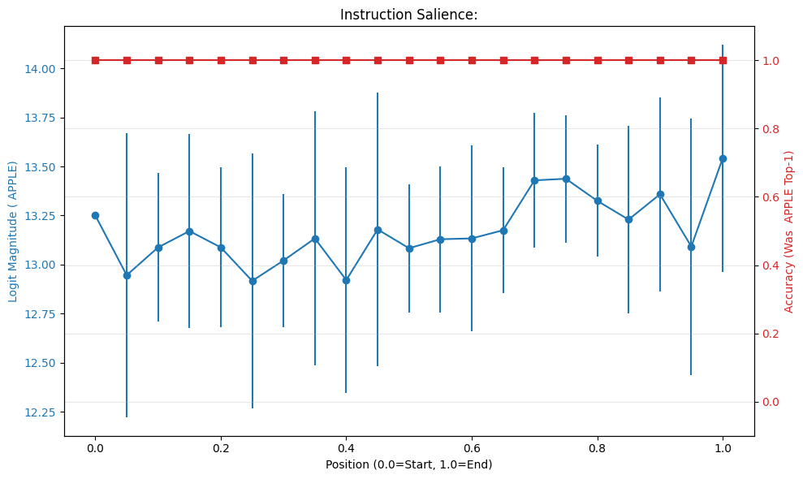
**Experiment 2 Activation patching on layers:**  
Patching the activations of the “corrupt” prompt from the activations of the “clean” prompt for any layer \< 29 has nearly 0 effect on logit difference. Patching later layers creates high logit differences in comparison to the baseline (-1.12) with logit “recovery” happening at layers **29-31** and **35-40**. This suggests that the prioritization mechanism isn’t a persistent effort, but rather happens just prior to output. The baselines are computed by calculating the logit difference (cherry \- apple) on the corrupted prompt at the terminal token and the logit difference (cherry \- apple) on the clean prompt at the terminal token.

**Experiment 3 \- Component wise activation patching:**  
Patching identified a subset of attention heads that significantly increased the logit difference in favor of Instruction A. Specifically, L35H0, L35H1, and L37H12 provided the largest positive logit shifts. However, Gemma-2-9b-it has Sliding Window Attention layers with a 4,096-token limit. Given that Instruction A was placed at the beginning of a 6144-token context, these heads were architecturally precluded from attending to it. The causal importance of these heads then likely stems from their role in processing the close-by Instruction B. In the corrupted state, these heads attend intensely to Instruction B; patching them with the clean state (where Instruction B was outside their window and thus invisible) effectively removes the recency signal from the residual stream. This suggests that the logit recovery observed when patching these layers is driven by the removal of competitive interference from the recent instruction rather than the active retrieval of the distant one. Conversely, L31H7 provided the largest negative logit shift, favoring the proximal instruction even more strongly when patched. While attention tracing confirms this head attends intensely to Instruction B, the fact that a "clean" patch (from a state where B was invisible) strengthened the logit for B is counter-intuitive. It’s not clear to me what the role of this head is in the prioritization mechanism.

A sweep of MLP patching across Layers 15 through 41 indicates that most intermediate MLPs do not play a role in instruction decision making; patching these layers resulted in logit differences that remained near the corrupted baseline of \-1.12. However, MLP layers 39 and 40 exhibited high causal influence with opposing effects. Patching MLP 39 resulted in a logit difference of \-2.00, a \-0.88 decrease from the baseline. This suggests that MLP 39 favors recent tokens over distant ones. Even in the "clean" run, this component likely contributes to the salience of recent tokens, and patching its activation into the corrupted run doubles down on this structural bias. Patching MLP 40 resulted in a logit difference of \-0.38, representing a \+0.74 recovery toward Instruction A. This is the only MLP where the “clean” activation provides a significant shift toward the distant instruction.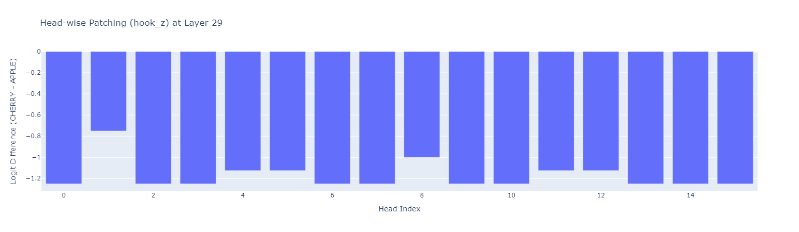
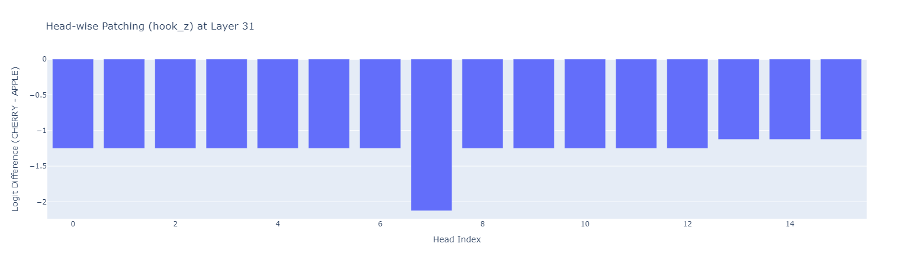

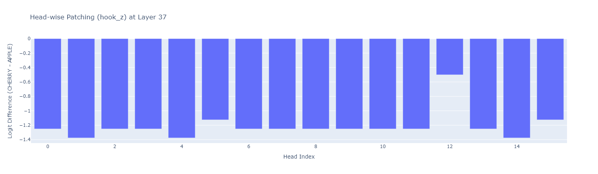

MLP patching results: Original (“CHERRY” \- “APPLE”) Logit Diff in **corrupted prompt**: \-1.12  
Logit Diff after patching MLP 15: **\-1.12**  
Logit Diff after patching MLP 16: **\-1.25**  
Logit Diff after patching MLP 17: **\-1.12**  
Logit Diff after patching MLP 18: **\-1.12**  
Logit Diff after patching MLP 19: **\-1.25**  
Logit Diff after patching MLP 20: **\-1.00**  
Logit Diff after patching MLP 21: **\-1.12**  
Logit Diff after patching MLP 22: **\-1.38**  
Logit Diff after patching MLP 23: **\-1.12**  
Logit Diff after patching MLP 24: **\-1.38**  
Logit Diff after patching MLP 25: **\-1.12**  
Logit Diff after patching MLP 26: **\-1.00**  
Logit Diff after patching MLP 27: **\-1.50**  
Logit Diff after patching MLP 28: **\-1.50**  
Logit Diff after patching MLP 29: **\-1.38**  
Logit Diff after patching MLP 30: **\-1.12**  
Logit Diff after patching MLP 31: **\-1.25**  
Logit Diff after patching MLP 32: **\-1.00**  
Logit Diff after patching MLP 33: **\-1.12**  
Logit Diff after patching MLP 34: **\-1.12**  
Logit Diff after patching MLP 35: **\-1.38**  
Logit Diff after patching MLP 36: **\-1.00**  
Logit Diff after patching MLP 37: **\-1.12**  
Logit Diff after patching MLP 38: **\-1.50**  
**Logit Diff after patching MLP 39: \-2.00**  
**Logit Diff after patching MLP 40: \-0.38**  
Logit Diff after patching MLP 41: **\-1.25**

**Experiment 4: Causal Validation via Quantitative Attention Tracing:**  
There is a nice correspondence between causal logit contribution and attention scores: heads that drive the logit difference attend directly to the instructions they represent. For example, L31H7 attends intensely to close instructions (B) (\~0.29), while L36H0 maintains a stable, lower-magnitude signal (\~0.10) to far away instructions (A) across both clean and corrupted runs. This suggests prioritization is a competition between a constant, small retrieval signal and a large, position-dependent recency signal. I identified that the 0.00 attention scores to instruction (A) in odd layers as a structural consequence of Sliding Window Attention (SWA), which precludes these heads from attending to far away context at 6k tokens. Notably, the 45% crossover persists in a separate 4k context experiment (entirely within the SWA window), indicating the prioritization behavior throughout this project is not solely explained by this architectural detail. 

****  
Attention scores on the corrupted prompt (Layers 20-40) (Instruction B pos 0.60)

| Top 5 Heads by Attention to APPLE: | Top 5 Heads by Attention to CHERRY: | Top 5 Heads by Attention to bos: |
| :---- | :---- | :---- |
| L31H7: 0.2908 | L36H0: 0.0930 | L30H0: 0.0078 |
| L35H0: 0.2770 | L38H0: 0.0067 | L36H0: 0.0003 |
| L35H1: 0.2015 | L30H0: 0.0038 | L38H0: 0.0000 |
| L37H12: 0.0591 | L29H1: 0.0000 | L29H1: 0.0000 |
| L29H1: 0.0298 | L31H7: 0.0000 | L31H7: 0.0000 |

Attention scores on the clean prompt (Layers 20-40) (Instruction B pos 0.25)

| Top 5 Heads by Attention to APPLE: | Top 5 Heads by Attention to CHERRY: | Top 5 Heads by Attention to bos: |
| :---- | :---- | :---- |
| L36H0: 0.0057 | L36H0: 0.1068 | L30H0: 0.0060 |
| L30H0: 0.0020 | L38H0: 0.0093 | L36H0: 0.0004 |
| L38H0: 0.0000 | L30H0: 0.0073 | L38H0: 0.0000 |
| L29H1: 0.0000 | L29H1: 0.0000 | L29H1: 0.0000 |
| L31H7: 0.0000 | L31H7: 0.0000 | L31H7: 0.0000 |

**Experiment 5: Instruction Forcefulness**  
Interestingly, stating Instruction A in a more forceful manner does not seem to alter the prioritization behavior in a significant way.  
**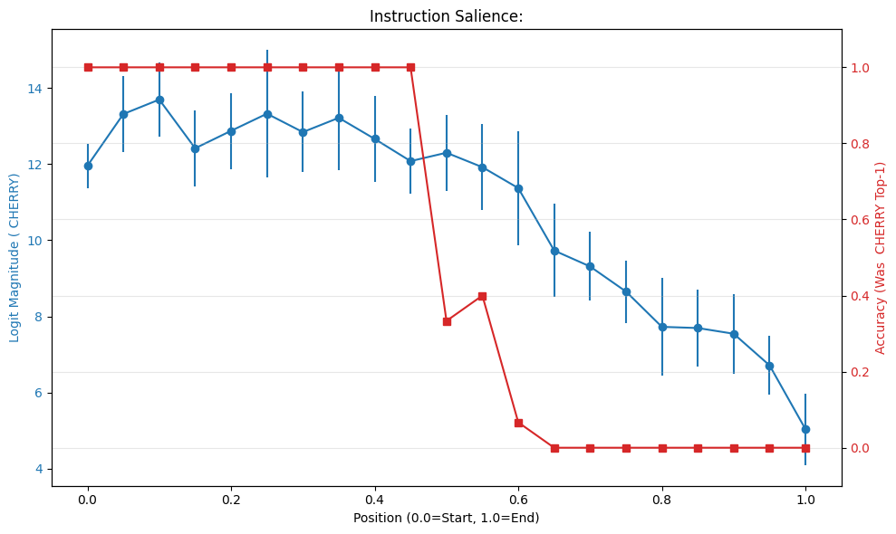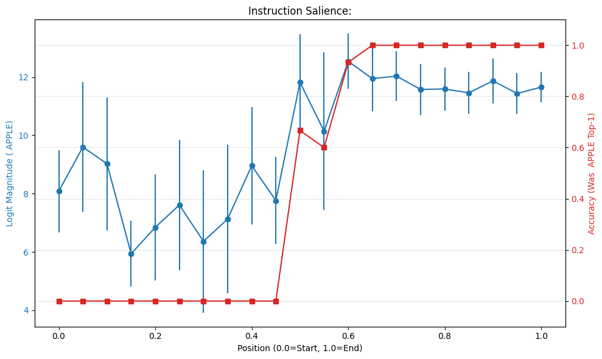**

## **Conclusion**

This research demonstrates that the failure to prioritize distant instructions is not a passive decay of information, but an active, late-stage arbitration process. By localizing the decision bottleneck to the model’s terminal layers, I identified that the model remains largely neutral to instruction conflicts until just prior to output generation. Mechanistic analysis reveals conflicting actors within this bottleneck, where global retrieval heads must overcome structural recency bias reinforced by late-layer MLPs. This competition is further constrained by the interleaved attention architecture, which architecturally precludes half of the model's layers from participating in long-range goal preservation. Understanding these specific decision-making circuits is a necessary step toward building models that are robust to contextual interference and capable of maintaining stable internal intent.

**Limitations and Future Work**

1. I am interested in the results of Experiment 1b, and wonder whether these results will change dramatically based on how I phrase the importance of instruction A vs. instruction B in the context.  
2. I almost exclusively conduct my experiments on Gemma-2-9b-it. I wonder what the instruction prioritization behavior would look like for larger and/or non instruction tuned models.  
3. Simplicity of instructions: I focused on instructions that were easy to verify whether they have been met. I’m not sure whether more complex instructions/constraints will subject the model to the same prioritization regime.  
4. I made the time-saving assumption that random wikipedia text is an accurate representation of language model use. In reality, it probably isn’t, though I’d still be surprised if the prioritization regime looks entirely different with different filler text.
